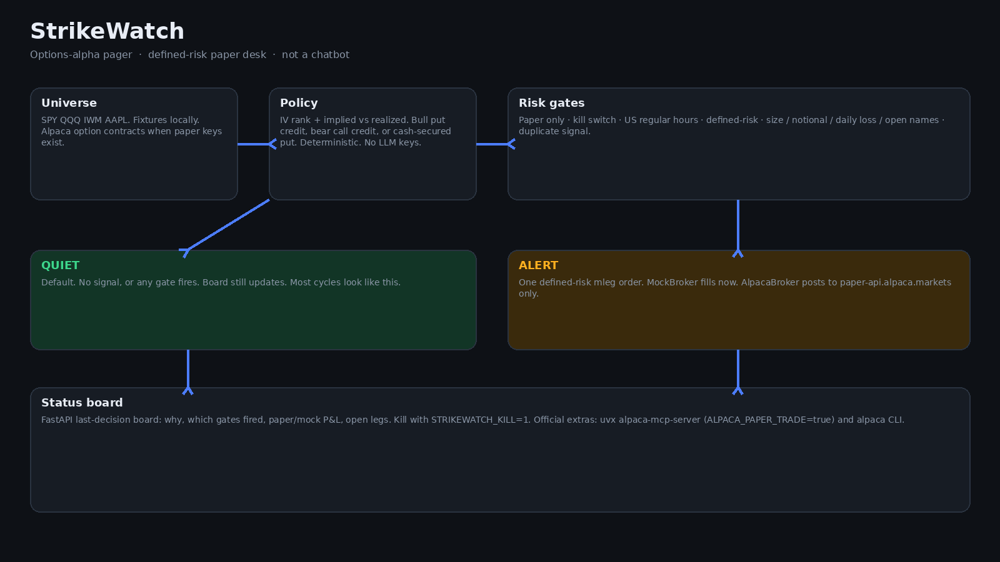

# StrikeWatch

A **background agent** for a paper options desk. It watches a small liquid universe (SPY, QQQ, IWM, AAPL) and pages a human **only** when:

1. a simple options-alpha signal is on (IV rank rich, implied fat versus realized), and
2. **every** risk gate passes, so the ticket is a defined-risk structure.

It is **not a chatbot**. Most cycles are quiet on purpose. The only UI is a status board: last decision, why, which gates fired, paper/mock P&amp;L, open legs.

Built for the [lablab.ai Alpaca AI Trading Agents Hackathon](https://lablab.ai) (28 Aug–4 Sep 2026), **Options Alpha Agents** track, by Jordi / [XnOwOCodes](https://github.com/XnOwOCodes) in Spain. MIT licensed. Paper trading only.



## The problem

Options desks do not need another chat window. They need a pager that stays dark until a defined-risk ticket is actually allowed. Naked short premium, duplicate signals, overnight ghosts, and live-key mistakes are how paper accounts stop being paper.

StrikeWatch sits in the background, reads a tiny universe, and stays quiet until a bull put credit, bear call credit, or cash-secured put clears the gates.

## Who it is for

A single operator running an Alpaca **paper** account through a hackathon weekend. One board. One kill switch. No LLM keys.

## Why this shape

- **Pager, not inbox.** The dashboard is a decision board, not a transcript.
- **Defined-risk only.** Spreads carry a long wing. Cash-secured puts reserve strike × 100. Naked shorts never leave the policy.
- **Gates before broker.** Paper-only, kill switch, size caps, US regular hours, duplicate-signal suppression.
- **Mock until keys exist.** Missing `ALPACA_API_KEY` / `ALPACA_SECRET_KEY` → `MockBroker`, no network.

## How it works

Each watch cycle:

1. Load the universe snapshot (fixtures locally; Alpaca option contracts when paper keys are set).
2. Score IV rank and IV − realized vol. Below thresholds → QUIET.
3. If a name is rich, build one defined-risk structure.
4. Run every risk gate. Any miss → QUIET, with the fired gates on the board.
5. If all pass → ALERT and submit one Alpaca Orders API payload (`order_class=mleg` + `legs[]` with `symbol`, `side`, `ratio_qty`).

The local policy is deterministic Python. Swap the snapshot source later; the gates do not change.

## How to run

Python 3.10+. No API keys for tests or dry-run.

```bash
python3 -m venv .venv
source .venv/bin/activate
pip install -e ".[dev]"
```

**Tests** (must pass with no network credentials):

```bash
pytest
```

**Dry-run demo** — quiet tape, then fat IV rank with a mock defined-risk order, then the same signal again (must not re-alert):

```bash
python -m strikewatch dry-run
```

**One cycle** against default quiet fixtures:

```bash
python -m strikewatch cycle
```

**Desk board** (last decision and why — still not a chat):

```bash
python -m strikewatch dashboard
```

Open [http://127.0.0.1:8000](http://127.0.0.1:8000). Use **Run watch cycle**. JSON is at `/api/status`.

### Fixtures

| Path | What |
| --- | --- |
| `fixtures/market.json` | Default tape (quiet) |
| `fixtures/chains/*.json` | OCC-style contracts for the universe |
| `fixtures/scenarios/quiet/` | IV rank asleep |
| `fixtures/scenarios/fat-iv/` | SPY IV rank rich enough to propose a credit spread |

Runtime writes (gitignored): `data/last_decision.json`, `data/session.json`, `data/mock_account.json`.

### Environment

| Variable | Purpose |
| --- | --- |
| `ALPACA_API_KEY` / `ALPACA_SECRET_KEY` | Paper keys. Missing → mock, no network |
| `ALPACA_PAPER_TRADE` | Must stay `true`. StrikeWatch refuses live |
| `STRIKEWATCH_KILL` | `1` blocks every order |
| `STRIKEWATCH_NOW` | Freeze clock (ISO-8601) for tests |
| `STRIKEWATCH_MARKET` | Snapshot JSON path |

## Architecture

See [docs/architecture.md](docs/architecture.md). Alpaca MCP + CLI notes: [strikewatch/mcp.md](strikewatch/mcp.md).

```
universe snapshot → IV rank / RV-IV policy → risk gates → QUIET or ALERT
ALERT → MockBroker or Alpaca paper REST (https://paper-api.alpaca.markets)
board reads data/last_decision.json
```

## One-page hackathon write-up

**AI logic.** No model keys. The policy is a deterministic scorer: IV rank from a 52-week IV band, plus implied minus 20-day realized. A name must clear both floors (defaults: rank ≥ 60, IV−RV ≥ 0.08). Highest rank wins. Neutral/bull bias builds a bull put credit (short OTM put, long further OTM put). Bear bias builds a bear call credit. If a wing is missing, fall back to a cash-secured put with full cash cover. Quiet is the default.

**Risk gates.** Paper only. Kill switch (`STRIKEWATCH_KILL` or a kill file). Max contracts per name, max notional (structure max loss), max daily loss, max open names. Defined-risk structure check (rejects naked shorts). US regular hours with an injectable clock. Duplicate-signal suppression for the session. Missing keys select `MockBroker` and never open a socket.

**Alpaca API / MCP / CLI.** `AlpacaBroker` is real REST against `https://paper-api.alpaca.markets` (`GET /v2/account`, `GET /v2/positions`, `GET /v2/options/contracts`, `POST /v2/orders`). Multi-leg bodies match the Orders API (`order_class=mleg`, legs with `symbol`, `side`, `ratio_qty`, `position_intent`). Official MCP: `uvx alpaca-mcp-server` with `ALPACA_PAPER_TRADE=true`. Official CLI equivalents: `alpaca account get`, `alpaca option contracts`, `alpaca api POST /v2/orders` — see `scripts/alpaca_cli_cycle.sh`.

## Paper-account submit checklist

- Dedicated **paper** Alpaca account. Do not reuse live keys.
- About **$100k** paper buying power (the mock desk starts there).
- `ALPACA_PAPER_TRADE=true` in `.env` and in the MCP `env` block.
- Never set `ALPACA_PAPER_TRADE=false`. Never set `ALPACA_LIVE_TRADE=true`.
- No funding. No live enablement. Kill switch stays one env flip away.

Copy `.env.example` → `.env` only on the machine that holds paper keys. `.env` is gitignored.

## License

MIT. See [LICENSE](LICENSE).
